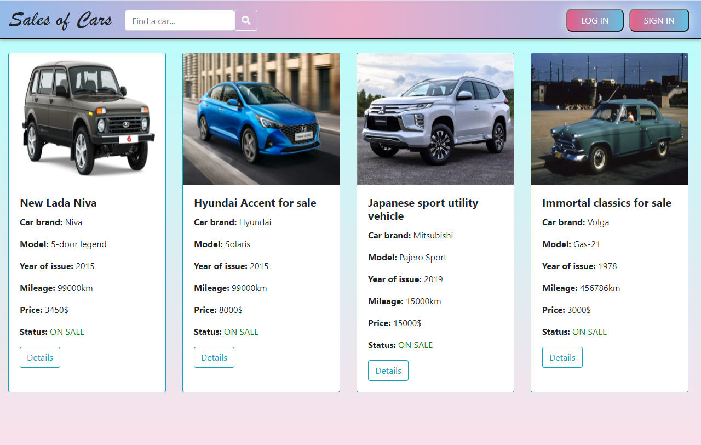
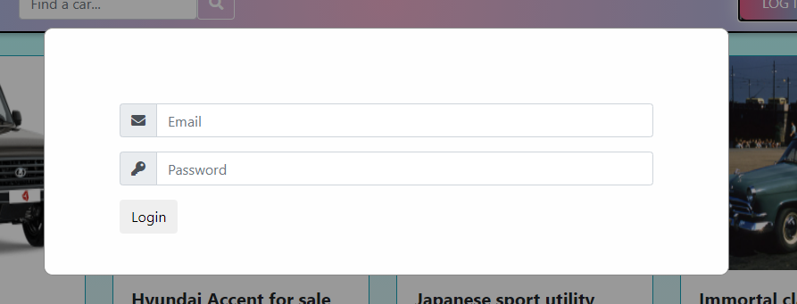
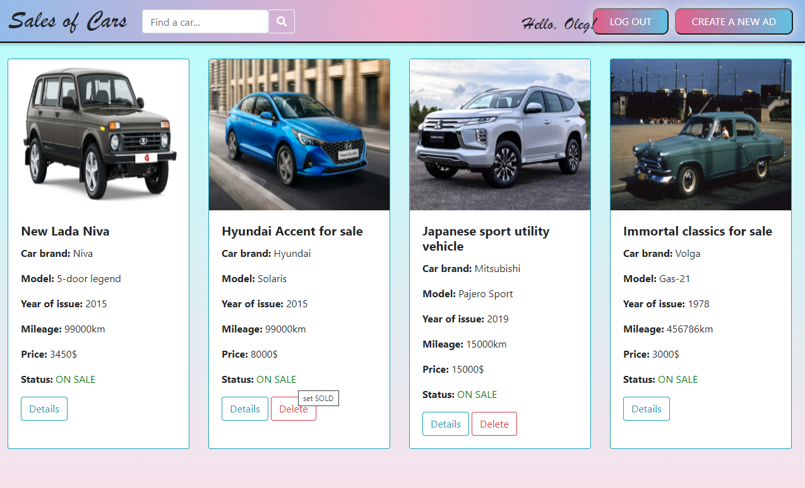
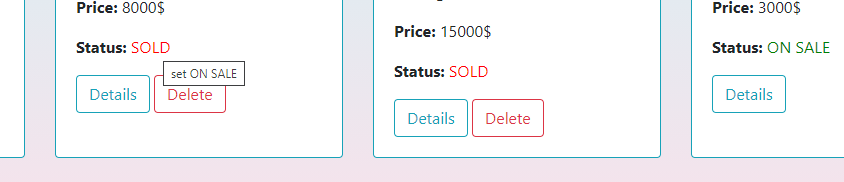
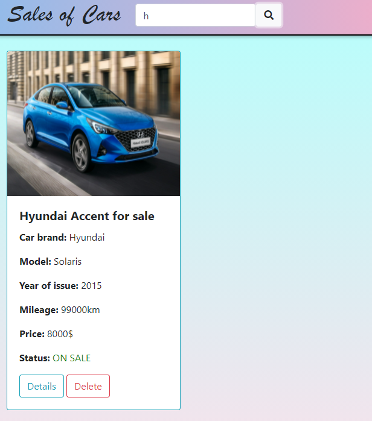
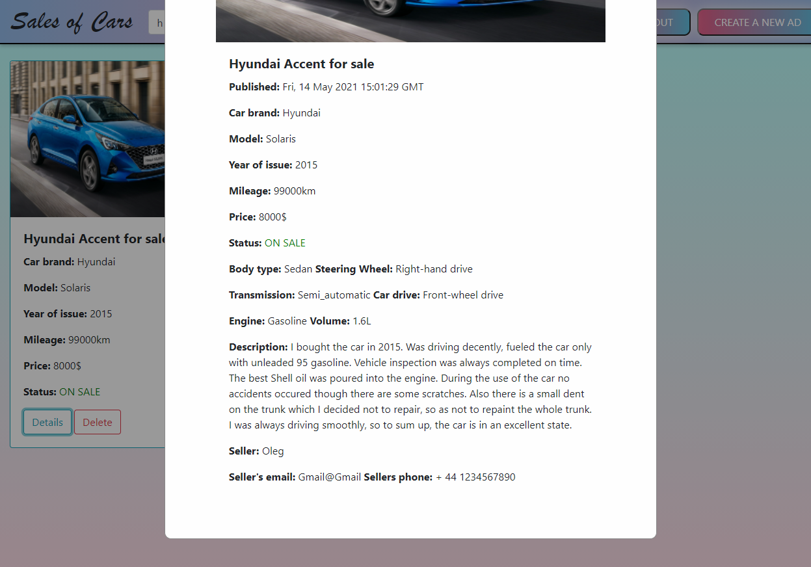
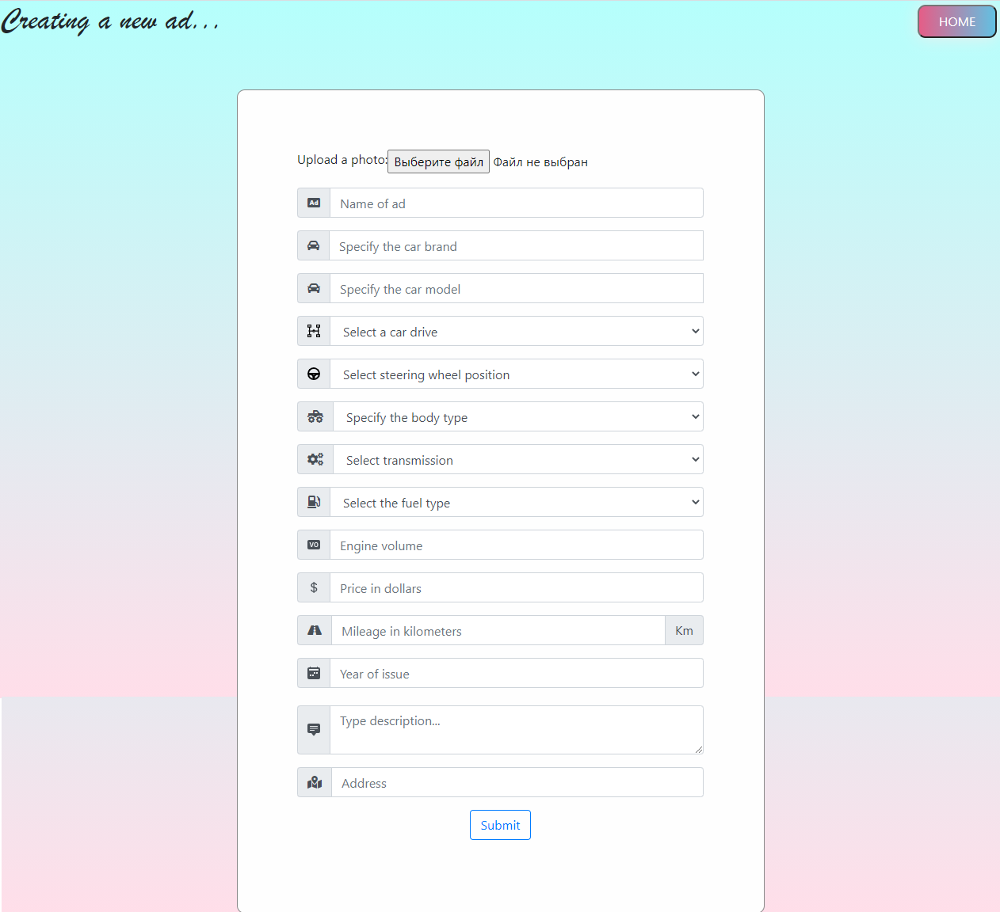

# Sales of cars
This is an online service for the sale of cars.

#### Functionality:

- Registering and logging in the system to be able to post an ad.
- Possibility to delete or change status of an ad for logged in users.
- Searching for the necessary car by the car brand.

#### Technologies:

- Java Servlet as a controller.
- JSP pages with JSTL snippets providing the view.
- Hibernate ORM leveraged for CRUD operations with the database.

#### Presentation:

The main page with all ads is available for all users including unauthorised.

Logging card.

Logging in (or registering if a user does not have an account yet) allows to create a new ad
or to delete an existing one posted by the current user. 

Also, it is possible to change the sale status.

By typing the first letters of car brand and pressing search button a user can filter out those ads that don't 
fit in.

All users are able to watch elaborate details about each ad.

Pressing "Create a new ad" button redirects a user (authorised) on the page with the form for creating a new ad.

